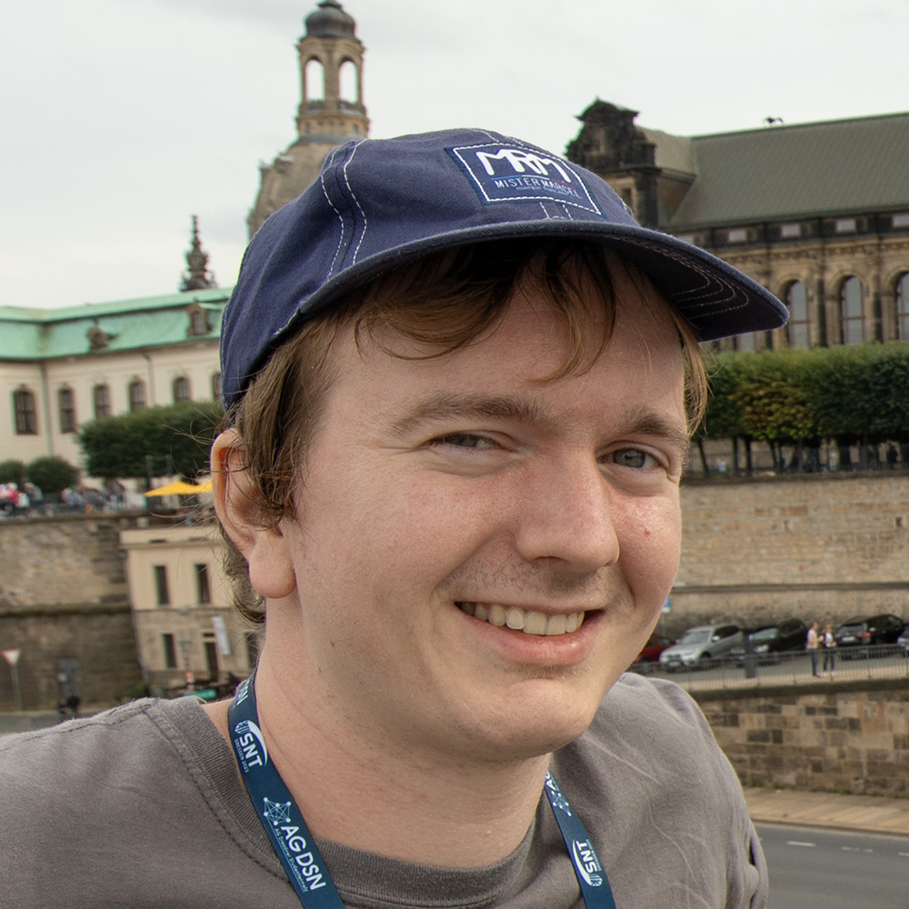

::: {.heading .me}
``` {=html}

```
<section>
# Me

[Benjamin Somers]{.name}[January 14, 1998]{.dob}<div>Research Engineer</div><span>[ben@federez.net](mailto:ben@federez.net) / [bensmrs@resel.fr](mailto:bensmrs@resel.fr)</span><div>Brest, France</div>

- [GitHub](https://github.com/bensmrs)
- [LinkedIn](https://www.linkedin.com/in/bensmrs/)
- [Twitter](https://twitter.com/ben_smrs)
<!-- section:close -->
</section>
:::

# A few words before the boring stuff

I was born in 1998 in Arles, Southern France, and have been constantly moving away from the warmth of its summers ever since, studying in Lyon, Brest and even Oslo. I started computing in primary school with a Windows 95 computer and a programmable Casio calculator. I got to where I am today through taking apart hundreds of electronic devices (and counting!) and unconventionally tinkering with stuff. Random choices led me to choose between a career as an entomologist (inspired in my childhood by Bernard Werber’s books), a computer scientist (inspired by my mother’s geek spirit and the wonderful technological developments that went on when I was a kid), or a marimbist/vibraphonist (inspired by my percussions teacher’s passion).

Over the years, I’ve developed a great passion for languages, whether “natural” or “for computers”, and how they influence the way we think (linguistic relativity, Sapir–Whorf hypothesis). On top of this came a keen interest in the design of intricate systems, with a great appreciation for the beauty of simple solutions to complex problems, and complex optimizations to answer seemingly simple problems. Don’t get me wrong, I also love unnecessarily complex solutions to ridiculously simple problems, and I relish the disabused look on my friends’ faces as they throw a shy, slightly anxious "But why?!" when I show them my latest horrors.

My ideal work day starts not too early in the morning with a bowl of tea, and includes a good hour of scientific and technical watch. I do plenty of OCaml and listen to music for at least 6 hours as the day passes. It continues well into the night with my friends, is cut short by a critical IT incident in one of my associations, which we resolve in a bar at 2am amidst inebriated flashes of lucidity, and ends at around 3:30am. Fortunately for my sleep, this ideal day doesn’t happen that often! I’m easy going once you get past the typical obstacles of dealing with a French person. I’m extremely loyal to the people around me, and I believe that my atypical life experiences give a fresh perspective to things; humble, without however bowing down to the *statu quo*.

<!-- section:close -->
<section class="split">
<section>
[]{.cvitem .skip style="--skip:140.5px;--med-skip:131px;--small-skip:122.5px;"}
<h1>Education</h1>
::: {type=cvitem image=arkea.png company="Crédit Mutuel Arkéa – IMT Atlantique" title="PhD student" location="Brest (FR)" period="Jan. 2021 – Mar. 2024" height=151 medheight=140 smallheight=129 twocols= mask=}
## “IT infrastructure modeling for risk identification and prevention”

- Development of an infrastructure description language
- Study of safety and security properties of heterogeneous models
- Facilitate automatic infrastructure certification
:::

::: {type=cvitem image=imt-atlantique.png company="IMT Atlantique" title="MEng student" location="Brest (FR)" period="Sep. 2016 – June 2020"}
- Studies in computer science, economics and signal processing
- Development of a conditional branch obfuscator in LLVM
- Creation of a mini-compiler for a stack language in OCaml
- Development of a connected home thermostat based on an ontology
- Final year of studies specializing in software development and IT metrology (sandwich year)
:::

::: {type=cvitem image=uio.svg company="Universitetet i Oslo" title="Exchange student" location="Oslo (NO)" period="Jan. – June 2018"}
- Studies in cybersecurity and operating systems
- Analysis of ISO 27000 standards and Intel x86 manuals
- Development of an operating system with a round-robin scheduler, memory manager and file system
:::
</section>

# Professional experience {.right}

::: {type=cvitem image=imt-atlantique.png company="IMT Atlantique" title="Research engineer" location="Brest (FR)" period="Apr. 2024 – now"}
- Contribution to research projects
- System and network administration
- Dissemination of FOSS values
:::

::: {.cvitem .skip style="--skip:151px;--med-skip:140px;--small-skip:129px;"}
:::

::: {type=cvitem image=arkea.png company="Crédit Mutuel Arkéa" title=Consultant location="Le Relecq (FR)" period="Sep. – Dec. 2020"}
- Development and documentation of QoS tools
- Creation of a scientific experimental framework for my PhD
:::

::: {type=cvitem image=arkea.png company="Crédit Mutuel Arkéa" title=Work-study location="Le Relecq (FR)" period="Oct. 2019 – Aug. 2020"}
- Creation and deployment of QoS metrics for banking activities
- Detection and analysis of incidents on payment services
- Development of tools to improve the reliability of the company’s electronic payment systems
:::

::: {type=cvitem image=arkea.png company="Crédit Mutuel Arkéa" title=Intern location="Le Relecq (FR)" period="Apr. – Sep. 2019"}
- Functional supervision of credit card transaction flows
- Production of Grafana dashboards to visualize QoS metrics
- Development of a Warp 10 metrics analysis framework
:::

::: {type=cvitem image=imt-atlantique.png company="IMT Atlantique" title=Intern location="Brest (FR)" period="Sep. 2018 – Feb. 2019"}
- Development of an alternative optimization/obfuscation pass manager for LLVM
- Design of a semantic classifier for ROP gadgets
:::

::: {type=cvitem image=irisa.png company=IRISA title=Intern location="Brest (FR)" period="July – Aug. 2017"}
- Study of software vulnerabilities according to compilation parameters
- Automation of a ROP vulnerability analyzer
:::

# Volunteering

::: {type=cvitem image=federez.png company=FedeRez title=Coordinator location="Paris (FR)" period="Dec. 2021 –"}
- Federation of the activities of 15 student ISPs and computing associations
- Organization of national events
- Defense of the rights of associations and dialogue with legislators
- Presidency of the 2022 term, vice-presidency of the 2023 term
:::

::: {type=cvitem image=resel.png company=ResEl title="System administrator" location="Brest, Nantes, Rennes (FR)" period="Nov. 2016 –"}
- Management of the Internet access and various services for IMT Atlantique students in Brest (600 students) and Rennes (100 students)
- Development of a streaming infrastructure to broadcast digital TV and watch it from a web browser
- Presidency of the 2020 term
:::

::: {type=cvitem image=imt-atlantique.png company="Foyer des élèves" subcompany="IMT Atl." title=Bartender location="Brest (FR)" period="Dec. 2016 – Dec. 2018"}
:::

::: {type=cvitem image=cyb.svg company=Escape subcompany="Cybernetisk Selskab" title=Bartender location="Oslo (NO)" period="Jan. – June 2018"}
:::

# Teaching {.right}

::: {type=cvitem image=resel.png company=ResEl title=Instructor location="Brest (FR)" period="Sep. 2021 –"}
- System and network administration training
:::

::: {type=cvitem image=imt-atlantique.png company="IMT Atlantique" title=Teacher location="Brest (FR)" period="Sep. 2021 – now"}
- Object-oriented modeling (Bachelor, 53h)
- Linux and C language (Bachelor, 10h)
- Git (Master, 3h)
- Concurrent systems modeling (Master, 21h)
- Languages and lambda calculus (Master, 30h)
- Student project mentoring (Bachelor, 14h)
- Codecamp tutoring (Master, 39h)
:::

<!-- section:close -->
</section>

<section class="split">
# Human languages

- French (mother tongue)
- English (C1)
- Norwegian (B1+, a bit rusty)

## I also used to learn

- German (was B2/C1 a long time ago; should come back after a month in Germany)
- Japanese (was A2)
- Czech (was A1)

## I want to learn

<ul><li>Danish and Swedish (should be easier after I’m C1 in Norwegian)</li><li class="half">Arabic</li><li class="half">Breton</li><li class="half">Spanish</li><li class="half">Russian</li><li class="half">Chinese</li></ul>

# Computer languages {.right}

## “Desktop”

<ul><li class="half">OCaml</li><li class="half">C++</li><li class="half">Python</li><li class="half">Java</li><li class="half">Bash</li><li class="half">C#</li><li>Anything I don’t pout about, really…</li></ul>

## “Web”

<ul><li class="half">HTML5/CSS3</li><li class="half">JavaScript</li><li class="half">PHP</li></ul>

## Queries

<ul><li class="half">SQL</li><li class="half">WarpScript</li><li class="half">XPath</li><li class="half">SPARQL</li></ul>

*I also have a pretty nice ranking on RegEx Crossword ([player #41003](https://regexcrossword.com/players/41003))*

<!-- section:close -->
</section>
